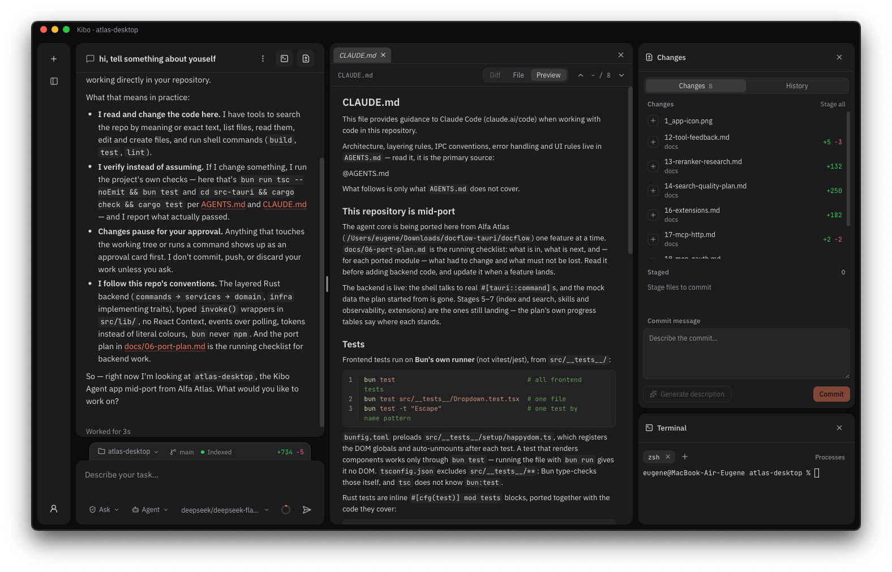

<p align="center">
  
</p>

<h1 align="center">Kibo Agent</h1>

<p align="center">
  A desktop coding agent that works in your repository.<br>
  It reads and searches code, edits files, runs commands and tests — and shows you what it did.
</p>

<p align="center">
  Tauri v2 · Rust · React · macOS / Windows / Linux · GPL-3.0
</p>

<p align="center">
  
</p>

---

## What it does

- **Three modes.** Agent reads, edits and runs commands. Plan writes a plan you can edit and hand to Agent with one click. Ask only answers.
- **Any model.** OpenAI-compatible providers (DeepSeek, OpenRouter, your own gateway) and Anthropic. Custom host, CA and request headers.
- **Semantic search, offline.** The code index and the bundled embedding model run locally. A question in Russian finds code written in English.
- **Approvals by what a command does.** `git status` runs silently and `cargo test` asks. `rm -rf`, `git push --force` and writes to `.bashrc` always ask, even under "Always allow".
- **Safe writes.** A file can be edited only after it was read, and only if its hash has not changed since. The approval card shows the diff before anything is written.
- **A real terminal and background processes.** A genuine PTY with xterm.js. Dev servers and watchers live between turns, and the agent reads their output.
- **Context as a budget.** A turn's budget is weighed by tool cost. History compacts itself, and old results are replaced with stubs. History is append-only, so the provider's prompt cache holds across rounds.
- **Extensions.** MCP servers, local or at a URL over Streamable HTTP (a Claude Desktop or Cursor config pastes in as is), skills, and hooks in the Claude Code format.
- **Themes.** Separate light and dark palettes — Apple's colours, One Dark, Latte — and every key in one registry, listed from the account menu.

## Your data stays yours

File contents go only to the model provider you chose, and tests enforce this. They fail if network code appears outside the provider, if a dependency brings telemetry, or if the window calls `fetch`. Keys live in the system keychain. Configuration from the opened repository (`.mcp.json`, hooks) is never executed.

More in [docs/08-data-policy.md](docs/08-data-policy.md).

## Installing

macOS (Apple Silicon) and Windows installers are attached to each [release](../../releases).

## Building

You need [Bun](https://bun.sh), Rust and [Git LFS](https://git-lfs.com) (the embedding model's weights are LFS objects).

```bash
git lfs pull
bun install
bun run tauri dev      # run with hot reload
bun run tauri build    # production bundle
```

## Checks

```bash
bun run tsc --noEmit && bun test
cd src-tauri && cargo test
```

The agent as a whole has its own bench: a real model fixes small broken repositories, and a hidden check judges the result ([src-tauri/bench/agent-tasks](src-tauri/bench/agent-tasks)). How to run it is in [CLAUDE.md](CLAUDE.md).

## Documentation

The docs are in Russian.

- [docs/09-product.md](docs/09-product.md) — the product: features and what sets it apart.
- [docs/03-architecture.md](docs/03-architecture.md) — how the core is built.
- [AGENTS.md](AGENTS.md) — layers, IPC and conventions for anyone writing code (in English).

## License

[GPL-3.0-only](LICENSE). The command classifier includes rules from [sh-guard](https://github.com/aryanbhosale/sh-guard), distributed under GPL-3.0.
